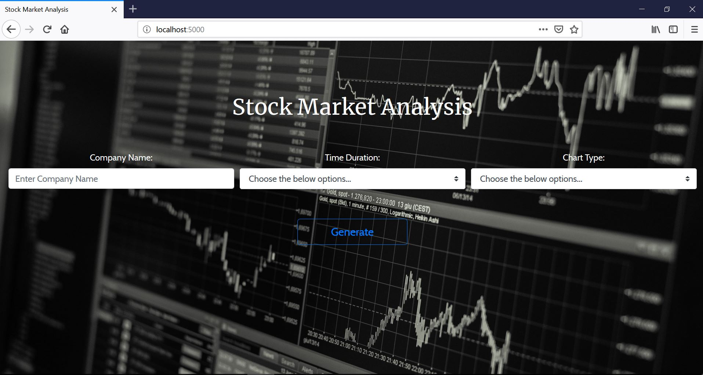
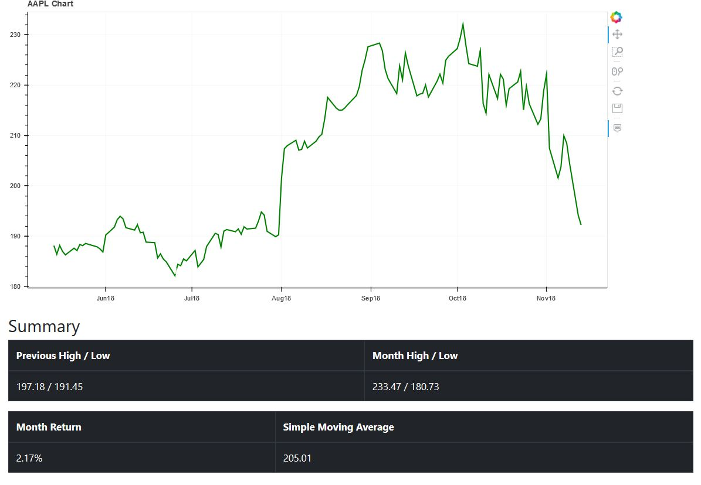

# Stock Price Visulaizer
### Flask based app to visulaize stock prices of different companies.

## Features:
* Uses NASDAQ to search company names in the database.
* Yahoo finance is used to fetch the data from through data reader library.
* Allows user to enter time-duration and chart type to get display the values.
* Stock data is displayed in the form charts and graph which gives a better understanding

## Technologies & Libraries:
* Python3
* Flask
* Wtforms
* Bokeh
* HTML, CSS
* Bootstrap
* Pandas

## Screenshots:

### Home Page with Search Bar

### Line chart with 6 months of data in Line chart

